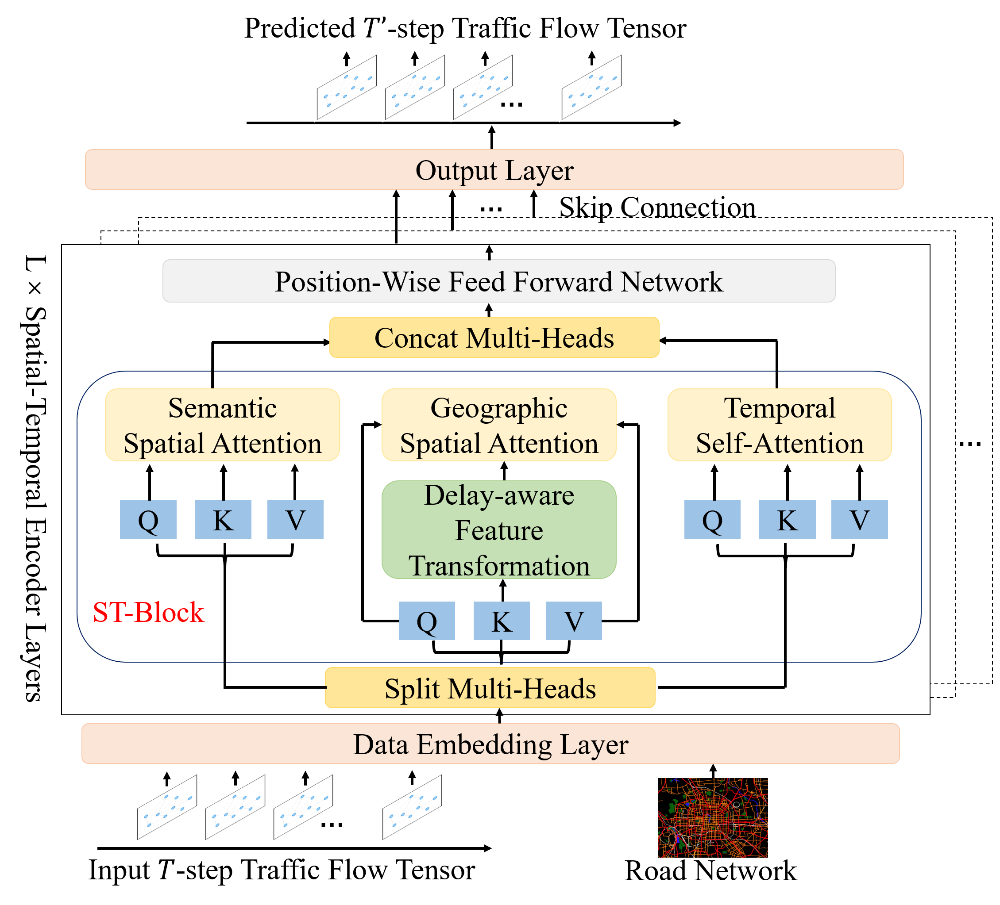

# [AAAI2023] PDFormer: Propagation Delay-aware Dynamic Long-range Transformer for Traffic Flow Prediction

This is a PyTorch implementation of Propagation Delay-aware Dynamic Long-range Transformer for Traffic Flow Prediction (**PDFormer**) for traffic flow prediction, as described in our paper: [Jiawei Jiang](https://github.com/aptx1231)\*, [Chengkai Han](https://github.com/NickHan-cs)\*, Wayne Xin Zhao, Xiaohan Jiang, JingyuanWang,  **[Propagation Delay-aware Dynamic Long-range Transformer for Traffic Flow Prediction](https://arxiv.org/abs/2301.07945)**, AAAI2023.

> \* Equal Contributions.



## Requirements

Our code is based on Python version 3.9.7 and PyTorch version 1.10.1. Please make sure you have installed Python and PyTorch correctly. Then you can install all the dependencies with the following command by pip:

```shell
pip install -r requirements.txt
```

## Data

You can get all 6 datasets from the [LibCity](https://github.com/LibCity/Bigscity-LibCity) repository.

The dataset link is [BaiduDisk with code 1231](https://pan.baidu.com/s/1qEfcXBO-QwZfiT0G3IYMpQ) or [Google Drive](https://drive.google.com/drive/folders/1g5v2Gq1tkOq8XO0HDCZ9nOTtRpB6-gPe?usp=sharing). All dataset used in LibCity needs to be processed into the [atomic files](https://bigscity-libcity-docs.readthedocs.io/en/latest/user_guide/data/atomic_files.html) format.

Note that our model would calculate a **DTW matrix** and a **traffic pattern set** for each dataset, which is time-consuming. Therefore, we have provided DTW matrices and traffic pattern sets of all datasets in `./libcity/cache/dataset_cache/`.

## Train & Test

You can train and test **PDFormer** through the following commands for 6 datasets.

```shell
python run_model.py --task traffic_state_pred --model PDFormer --dataset PeMS04 --config_file PeMS04
python run_model.py --task traffic_state_pred --model PDFormer --dataset PeMS08 --config_file PeMS08
python run_model.py --task traffic_state_pred --model PDFormer --dataset PeMS07 --config_file PeMS07
python run_model.py --task traffic_state_pred --model PDFormer --dataset NYCTaxi --config_file NYCTaxi
python run_model.py --task traffic_state_pred --model PDFormer --dataset CHIBike --config_file CHIBike
python run_model.py --task traffic_state_pred --model PDFormer --dataset T-Drive --config_file T-Drive
```

If you have trained a model as above and only want to test it, you can set it as follows (taking PeMS08 as an example, assuming the experiment ID during training is $ID):

```shell
python run_model.py --task traffic_state_pred --model PDFormer --dataset PeMS08 --config_file PeMS08 --train false --exp_id $ID
```

## Contributors

<a href="https://github.com/NickHan-cs"></img></a> <a href="https://github.com/aptx1231"></img></a>

## Reference Code

Code based on [LibCity](https://github.com/LibCity/Bigscity-LibCity) framework development, an open source library for traffic prediction.

## Cite

If you find the paper useful, please cite as following:

```
@inproceedings{pdformer,
  title={PDFormer: Propagation Delay-aware Dynamic Long-range Transformer for Traffic Flow Prediction},
  author={Jiawei Jiang and 
  		  Chengkai Han and 
  		  Wayne Xin Zhao and 
  		  Jingyuan Wang},
  booktitle = {{AAAI}},
  publisher = {{AAAI} Press},
  year      = {2023}
}
```

If you find [LibCity](https://github.com/LibCity/Bigscity-LibCity) useful, please cite as following:

```
@inproceedings{libcity,
  author    = {Jingyuan Wang and
               Jiawei Jiang and
               Wenjun Jiang and
               Chao Li and
               Wayne Xin Zhao},
  title     = {LibCity: An Open Library for Traffic Prediction},
  booktitle = {{SIGSPATIAL/GIS}},
  pages     = {145--148},
  publisher = {{ACM}},
  year      = {2021}
}
```

